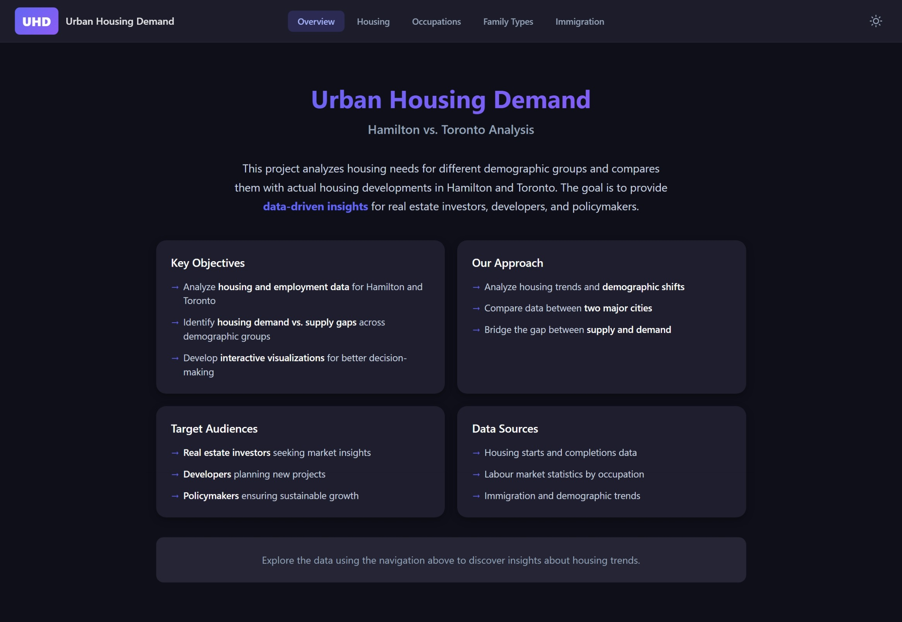
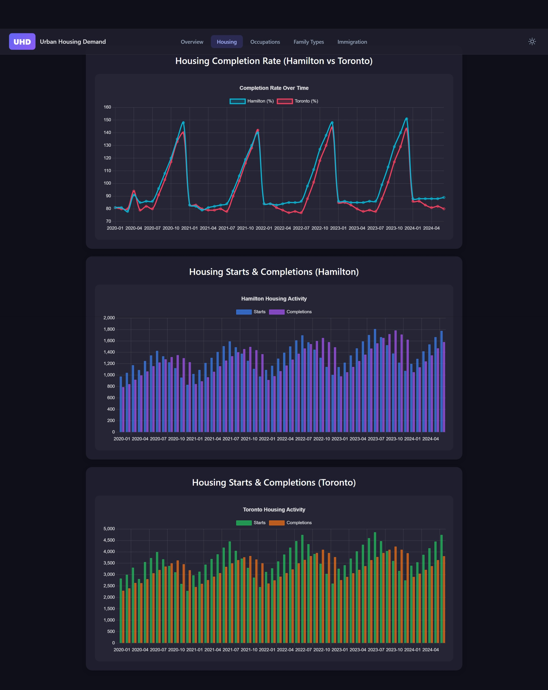
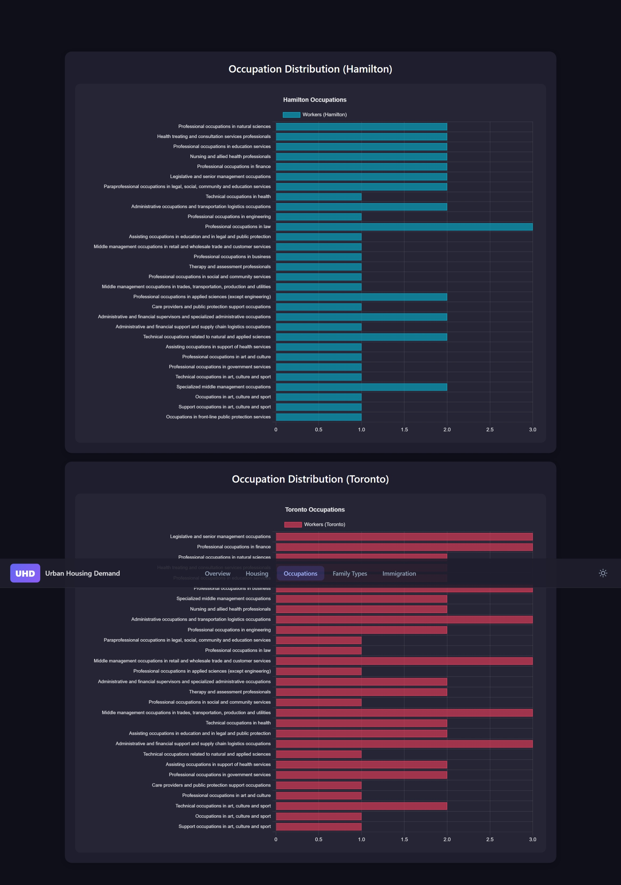

# Urban Housing Demand

[](https://github.com/haseebn19/urban-housing-demand/actions/workflows/ci.yml)

A full-stack web application for visualizing housing and labour market data for Toronto and Hamilton, Ontario.

## Screenshots







## Features

- **Housing Data Visualization**: Track housing starts and completions over time
- **Completion Ratios**: Compare completion rates between Toronto and Hamilton
- **Labour Market Analysis**: View occupation and family type distributions
- **Immigration Trends**: Monitor immigration patterns in both cities
- **Dark/Light Theme**: Toggle between themes for comfortable viewing

## Prerequisites

- [Docker Desktop](https://www.docker.com/products/docker-desktop/)

## Installation

```bash
git clone https://github.com/haseebn19/urban-housing-demand.git
cd urban-housing-demand
```

## Usage

```bash
# Set required database password (no default for security)
export DB_PASSWORD=your_secure_password   # Linux/macOS
# Or: $env:DB_PASSWORD="your_secure_password"  # PowerShell

# Start application
docker compose up -d
```

Open http://localhost:3000

## Development

### Testing

```bash
# Run all tests
docker compose -f compose.test.yaml up --build
```

### Linting

```bash
# Frontend (ESLint)
cd frontend && npm run lint

# Backend (Checkstyle)
cd backend && ./gradlew checkstyleMain

# Ingestor (Ruff)
cd ingestor && ruff check .
```

## Building

```bash
docker compose build
```

Output: Docker images for frontend, backend, database, and ingestor services.

## Documentation

Full documentation is in the **`docs/`** folder (and can be published as a GitHub Wiki):

| Doc | Description |
|-----|-------------|
| [Getting Started](docs/Getting-Started.md) | Installation, env vars, basic commands |
| [Architecture](docs/Architecture.md) | System design and components |
| [API Reference](docs/API-Reference.md) | REST endpoints |
| [Database Schema](docs/Database-Schema.md) | Tables and mappings |
| [Development Guide](docs/Development-Guide.md) | Contributing, local dev, CI/CD |

## Tech Stack

| Layer | Technology |
|-------|------------|
| Frontend | React 18, TypeScript, Vite, Chart.js |
| Backend | Spring Boot 3.4, Java 21 |
| Database | MariaDB/MySQL |
| Ingestor | Python 3.12 |
| DevOps | Docker, GitHub Actions |

## Project Structure

```
urban-housing-demand/
├── frontend/          # React application
├── backend/           # Spring Boot API
├── database/          # SQL schema & seed data
├── ingestor/          # Python data loader
├── docs/              # Documentation source
├── .env.example       # Example env (copy to .env)
└── compose.yaml      # Docker orchestration
```

## Contributing

1. Fork the repository
2. Create a feature branch (`git checkout -b feature/amazing-feature`)
3. Commit your changes (`git commit -m 'Add amazing feature'`)
4. Push to the branch (`git push origin feature/amazing-feature`)
5. Open a Pull Request

## Credits

- [React](https://react.dev/) - Frontend framework
- [Chart.js](https://www.chartjs.org/) - Data visualization
- [Spring Boot](https://spring.io/projects/spring-boot) - Backend framework
- [MariaDB](https://mariadb.org/) - Database

## License

Developed for CIS*4900 at the University of Guelph.
